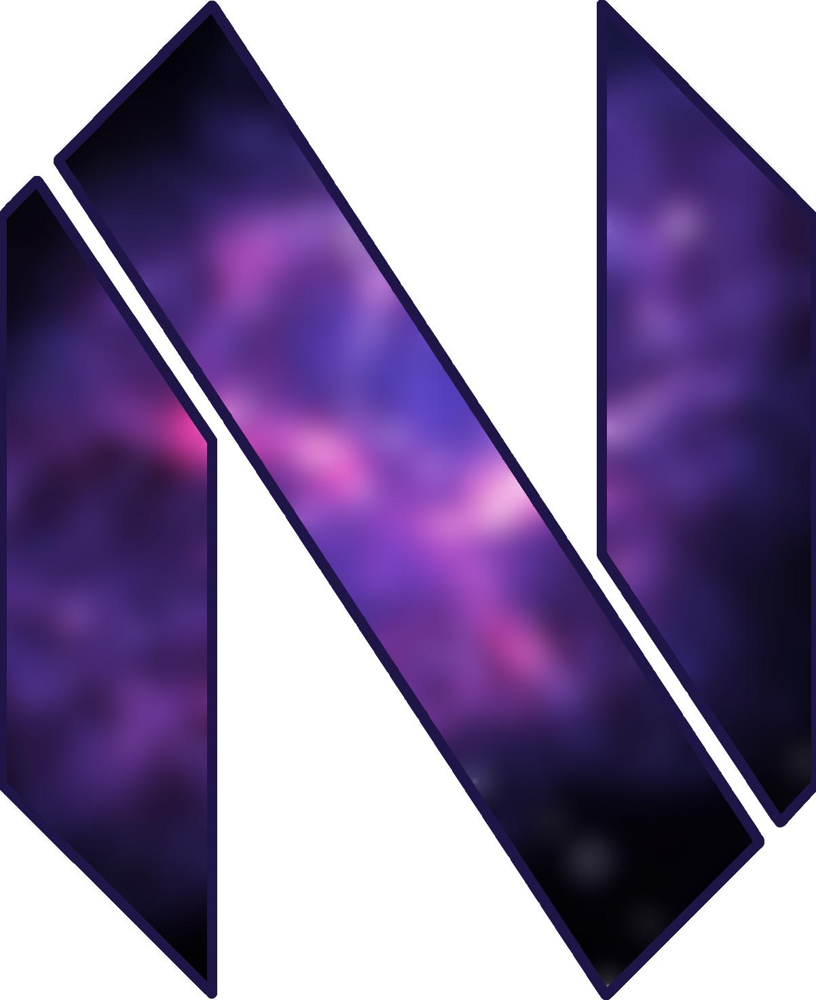

<h1 align="center">
    
    PLUTO
    
</h1>

<h2 align="center">
    Neovim configuration made for <a href="https://github.com/kinzoku-dev/nebula">NEBULA</a>
</h2>

<h1 align="center">
    
     
     
    

        <a href="https://github.com/kinzoku-dev/pluto/issues">
            
        
        
        
         
    

    
</h1>

**Created with [nvf](https://github.com/notashelf/nvf)**

# Gallery

    
📸 Screenshots

    No screenshots yet :(

# Credits

<ul>
    <li>
        <a href="https://github.com/notashelf">NotAShelf</a>
        For creating nvf and helping with configuration
    </li>
    <li>
        <a href="https://github.com/ardishko">Ardishco</a>
        For helping with configuration
    </li>
</ul>
